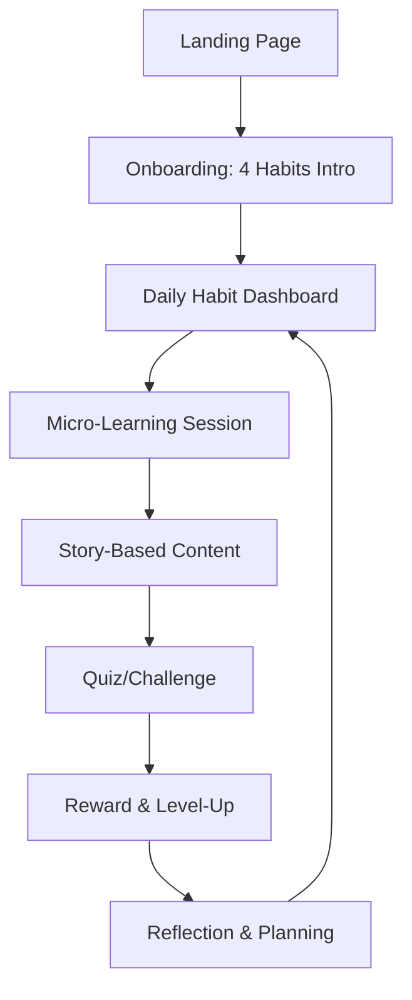
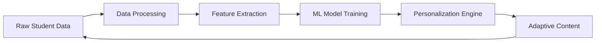

# AI-Powered Learning App Design: Tower of Learning

## App Concept Explanation

Tower of Learning reimagines education as an epic, personalized adventure inspired by the Tower of God manhwa. At its heart is an intelligent AI teacher that functions as a dedicated human mentor, dynamically adapting to each student's emotional state, learning rhythm, and behavioral cues. The platform systematically cultivates four essential learning habits that form the foundation of academic success:

- **Consistency**: Daily micro-learning rituals that weave learning into everyday life
- **Focus**: Distraction-minimized content delivery that honors attention spans
- **Curiosity**: Narrative-driven lessons that spark imagination and intrinsic motivation
- **Confidence**: Progressive achievement systems that celebrate growth and mastery

Powered by advanced behavioral analytics, the AI continuously refines its approach, creating truly individualized learning journeys. Unlike conventional educational apps that treat all students identically, Tower of Learning views every setback as a stepping stone, deploying encouragement over criticism and evolving its pedagogy through ongoing interaction with real student data.

## UI/UX Flow (Early UI Focus)

The early UI experience is meticulously crafted to onboard new users and instill the four core learning habits through a carefully sequenced progression. This habit-building journey transforms initial engagement into lasting learning routines:



### Key Early UI Screens:

1. **Habit Introduction Carousel**
   - Swipeable interactive cards featuring animated habit icons
   - "Consistency" displays an animated calendar with streak visualization
   - "Focus" showcases collapsing content blocks with focus timers
   - "Curiosity" reveals branching story paths with character choices
   - "Confidence" presents a level-up animation with achievement unlocks

2. **Daily Habit Dashboard**
   - Circular progress rings for each habit (inspired by fitness trackers)
   - Personalized morning greeting: "Ready to continue your ascent, [Name]?"
   - Real-time habit completion indicators with motivational quotes
   - One-tap access to personalized micro-learning recommendations

3. **Micro-Learning Interface**
   - Adaptive 1-5 minute content modules based on attention patterns
   - Single-concept focus with rich visual accompaniments
   - Interactive progress indicators with estimated completion times
   - AI-generated encouragement messages: "You're building great habits!"

4. **Story Integration Layer**
   - Seamless narrative overlay that contextualizes learning content
   - Dynamic character development reflecting personal progress
   - Performance-based story branching with multiple endings
   - Achievement-linked story rewards and collectible elements

## Mood-Based AI Logic

The AI teacher uses a multi-input mood detection system to adapt teaching style in real-time:

### Input Signals:
- **Interaction Patterns**: Click frequency, hesitation time, navigation behavior
- **Performance Metrics**: Response speed, error rates, completion times
- **Behavioral Indicators**: Session length, return frequency, feature usage
- **Optional Real-time**: Facial expressions, typing patterns, device interaction

### Mood Detection Algorithm:
```
mood_score = weighted_average([
    interaction_engagement (0.3),
    performance_confidence (0.3),
    behavioral_patterns (0.2),
    real_time_signals (0.2)
])

mood_states = {
    frustrated: mood_score < 0.3,
    neutral: 0.3 <= mood_score < 0.7,
    engaged: mood_score >= 0.7
}
```

### Adaptive Teaching Responses:

| Mood State | Teaching Tone | Content Length | Learning Format | Example Response |
|------------|---------------|----------------|-----------------|------------------|
| Frustrated | Calm, supportive | Micro (1-2 min) | Visual aids, simple | "Let's break this down step by step..." |
| Neutral | Balanced, encouraging | Standard (3-5 min) | Mixed formats | "You're doing well, let's try this next..." |
| Engaged | Energetic, challenging | Deep (5-10 min) | Stories, complex | "Great focus! Let's explore this further..." |

## Habit-Building Framework

The AI creates dynamic learning profiles that evolve with student behavior:

### Profile Components:
- **Chronotype Analysis**: Optimal learning times based on session performance
- **Format Preferences**: Visual, auditory, kinesthetic learning style weights
- **Reward Sensitivity**: Response patterns to different reward types
- **Pace Optimization**: Ideal content consumption speed
- **Interest Mapping**: Hobbies and interests for personalized content generation
- **ADHD-Specific Adaptations**: Attention patterns and preferred engagement styles

### Personalization Engine:
```
learning_profile = {
    best_times: analyze_session_times(),
    preferred_formats: track_format_engagement(),
    reward_system: identify_motivation_triggers(),
    difficulty_curve: calculate_optimal_challenge(),
    interests: extract_hobbies_and_interests(),
    adhd_profile: analyze_attention_patterns()
}
```

### Adaptive Scheduling:
- Morning sessions for peak performers
- Evening reviews for reinforcement
- Weekend deep-dive sessions
- Micro-breaks during optimal focus windows

## Gamified Dopamine System

Learning is transformed into an addictive positive feedback loop:

### Core Dopamine Triggers:

1. **Streaks**: Daily login chains with escalating rewards
   - Visual flame animation growing with streak length
   - Bonus XP multipliers (1.5x at 7 days, 2x at 30 days)
   - Streak protection (one missed day doesn't break chain)

2. **XP Progression**: Transparent point system with clear goals
   - Real-time XP bar fills with satisfying animations
   - Level-ups unlock new content and abilities
   - XP previews for upcoming activities

3. **Achievement Badges**: Meaningful milestones with narrative
   - "First Floor Conqueror" for completing initial lessons
   - "Story Weaver" for engaging with narrative elements
   - "Habit Master" for maintaining consistency streaks

4. **Story Progression**: Epic narrative tied to learning
   - Student as protagonist climbing the tower
   - Chapter unlocks based on concept mastery
   - Character development reflecting learning growth

### Failure Handling:
- **No Punishment**: Wrong answers provide hints and retry options
- **Encouragement Focus**: "Let's try a different approach together"
- **Progress Preservation**: Partial credit for effort and participation
- **Difficulty Adjustment**: Automatic scaling based on frustration signals

## AI-Generated Hobby-Based Learning Content

The AI teacher generates personalized educational content by analyzing student interests and hobbies:

### Content Generation Process:
1. **Interest Discovery**: AI analyzes user interactions, social media (with permission), and direct input to identify hobbies
2. **Context Mapping**: Educational concepts are mapped to relevant hobby contexts
3. **Adaptive Generation**: Quiz questions and learning materials are created using hobby themes
4. **Engagement Optimization**: Content difficulty and format adjust based on attention patterns

### Example Transformations:
- **Sports Fan**: Physics problems framed as "How does a quarterback's throw relate to projectile motion?"
- **Gamer**: Programming concepts explained through game development scenarios
- **Music Lover**: Mathematical patterns demonstrated through rhythm and musical theory
- **Artist**: Geometry lessons using perspective drawing and color theory

### ADHD-Specific Benefits:
- **Relevance**: Content connects to existing interests, improving engagement
- **Contextual Learning**: Abstract concepts become concrete through familiar frameworks
- **Motivation**: Learning feels like exploring hobbies rather than academic obligation
- **Memory Retention**: Hobby-based associations improve long-term knowledge retention

## ADHD-Friendly Design Principles

The platform is built with neurodiversity in mind:

### Content Structure:
- **Ultra-Short Blocks**: 1-2 minute micro-lessons
- **Single Focus**: One concept per screen, no multitasking
- **Visual Hierarchy**: Clear, bold typography with ample white space
- **Progressive Disclosure**: Information revealed gradually

### Learning Modalities:
- **Visual Learning**: Animated diagrams, mind maps, video demonstrations
- **Audio Support**: Narrated content with adjustable speed
- **Interactive Elements**: Drag-and-drop, drawing, gamified quizzes
- **Kinesthetic Options**: Movement-based learning activities
- **Hobby-Based Content**: AI-generated quizzes and questions tailored to student interests and hobbies
- **Interactive In-App Videos**: Embedded video player with pause points for comprehension questions during playback
- **Video-Integrated Quizzes**: Interactive quizzes that appear during video segments to reinforce learning in real-time

### Feedback Systems:
- **Instant Gratification**: Immediate response to all interactions
- **Positive Reinforcement**: Celebratory animations for correct answers
- **Encouragement Loops**: AI messages like "Great job staying focused!"
- **Progress Visualization**: Clear completion indicators

### Interface Design:
- **Minimal Distractions**: Clean layouts with focused content areas
- **Predictable Navigation**: Consistent button placement and behavior
- **Touch-Friendly**: Large tap targets, gesture support
- **Customizable**: Font sizes, color schemes, notification preferences

## Data Flow (Teaching the AI)

### Data Sources:
- **Direct Interactions**: Button clicks, time spent on screens, navigation paths
- **Performance Data**: Quiz scores, response times, error patterns
- **Behavioral Metrics**: Session frequency, feature usage, completion rates
- **Attention Signals**: Focus duration, distraction indicators
- **Mood Indicators**: Interaction patterns, feedback responses

### AI Learning Pipeline:



### Privacy & Ethics Framework:

1. **Data Minimization**: Only collect necessary behavioral data
2. **Anonymization**: All data processed without personal identifiers
3. **User Consent**: Transparent data usage with opt-out options
4. **Secure Storage**: Encrypted data with regular audits
5. **Ethical AI**: Bias monitoring and fairness checks
6. **Transparency**: Explainable AI decisions with user access

### Continuous Improvement:
- **A/B Testing**: New features tested on anonymized user segments
- **Feedback Loops**: User surveys and behavior analysis
- **Model Updates**: Regular retraining on aggregated data
- **Performance Monitoring**: AI effectiveness measured against learning outcomes

## Use Cases

### ADHD Student (Emma, 14)
**Challenge**: Short attention span, easily frustrated with complex content
**AI Adaptation**: Detects frustration from slow responses and errors
**Experience**: Ultra-short visual lessons (1 min each), instant feedback with sound effects, story-based engagement
**Outcome**: Maintains 5-day streak, improves focus through gamified rewards

### Average Student (Alex, 16)
**Challenge**: Maintains steady pace but lacks motivation
**AI Adaptation**: Balanced approach with story integration
**Experience**: Standard-length content with narrative elements, XP rewards for completion
**Outcome**: Discovers curiosity through story progression, builds confidence via level-ups

### Slow Learner (Jordan, 15)
**Challenge**: Needs more time and repetition for concept mastery
**AI Adaptation**: Calm tone, extended micro-sessions, extra encouragement
**Experience**: Longer breaks between concepts, repeated exposure with different formats
**Outcome**: Steady progress through consistent habits, personalized pacing prevents burnout

## Future Scope

### Real-Time Emotion & Focus Detection
- **Facial Recognition**: Camera-based emotion detection for immediate mood adaptation
- **Eye Tracking**: Focus measurement through gaze patterns
- **Physiological Signals**: Heart rate variability via wearables
- **Voice Analysis**: Tone and speech patterns for engagement assessment

### Advanced Features:
- **AR/VR Integration**: Immersive learning environments
- **Social Learning**: Collaborative quests and peer challenges
- **Conversational AI**: Natural language tutoring sessions
- **Predictive Analytics**: Early intervention for struggling students
- **Cross-Platform Sync**: Seamless learning across devices
- **Advanced Personalization**: Multi-modal content generation
- **Therapeutic Applications**: Learning support for neurodiverse conditions
- **Global Accessibility**: Multi-language support with cultural adaptation

### Technical Roadmap:
- **Phase 1**: Enhanced mood detection with basic biometrics
- **Phase 2**: AR learning modules and social features
- **Phase 3**: Full AI conversation system and predictive interventions
- **Phase 4**: Global expansion with adaptive cultural content